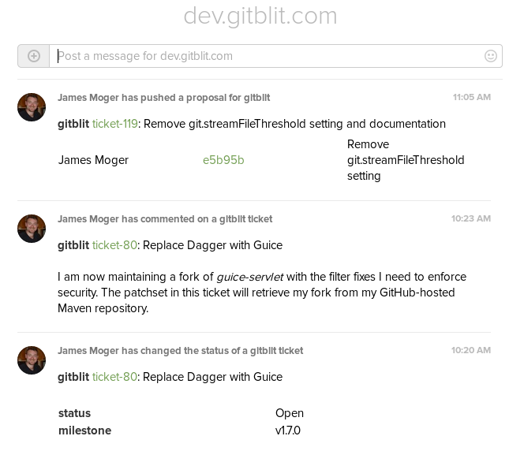

## Gitblit Glip plugin

*REQUIRES 1.5.0*

The Gitblit Glip plugin provides realtime integration for your Glip team.  The plugin inject events into a conversation for branch or tag changes and ticket changes.

### Installation

This plugin is referenced in the Gitblit Plugin Registry and you may install it using SSH with an administrator account.

    ssh host plugin refresh
    ssh host plugin install glip
    ssh host plugin ls

Alternatively, you can download the zip from [here](http://plugins.gitblit.com) manually copy it to your `${baseFolder}/plugins` directory.

### Setup

At a bare minimum you'll need one setting configured in `gitblit.properties`.

    glip.defaultToken = aToken

If you have the `powertools` plugin installed, you may configure this over SSH:

    ssh host gb config glip.defaultToken aToken

There a handful of additional optional settings:

    glip.useProjectConversations = false
    glip.postPersonalRepos = false
    glip.postTickets = true
    glip.postTicketComments = true
    glip.postBranches = true
    glip.postTags = true
    glip.defaultIcon =
    glip.ticketIcon =
    glip.gitIcon =

#### glip.useProjectConversations

*glip.useProjectConversations* allows you to shard Gitblit activity by the repository project.  This may fit better with any security model you may have in place.  These conversations *must* already exist in Glip, the plugin will not create them for you.

<pre>
glip.defaultToken = aToken
glip.useProjectConversations = true
glip.network.token = 12345
</pre>

- For the *network/a/b/myrepo.git* repository, the conversation would be *network*.
- For the *test.git* repository, the conversation would be the default conversation.

#### glip.*Icon

By default, Gitblit will use the Gravatar thumbnail for the event image.  If you would rather specify a fixed image to use for git or ticket events, then you may override these settings with the url of an image.  A 48px image seems to be the most appropriate dimension.

### Usage

#### Ticket Hook

The ticket hook is automatic.

#### Receive Hook

The receive hook is automatic.

#### SSH Commands (optional)

This plugin also provides a generic mechanism to inject messages into a Glip conversation.  These commands require administrator permissions.

    ssh host glip test
    ssh host glip send project -m "'this is a test'"

### Building against a Gitblit RELEASE

    ant && cp build/target/glip*.zip /path/to/gitblit/plugins

### Building against a Gitblit SNAPSHOT

    /path/to/dev/gitblit/ant installMoxie
    /path/to/dev/glip/ant && cp build/target/glip*.zip /path/to/gitblit/plugins

